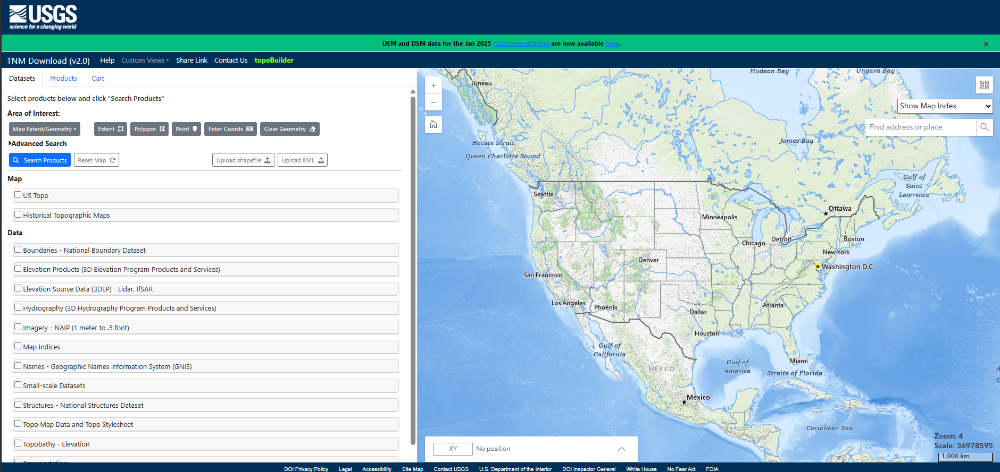
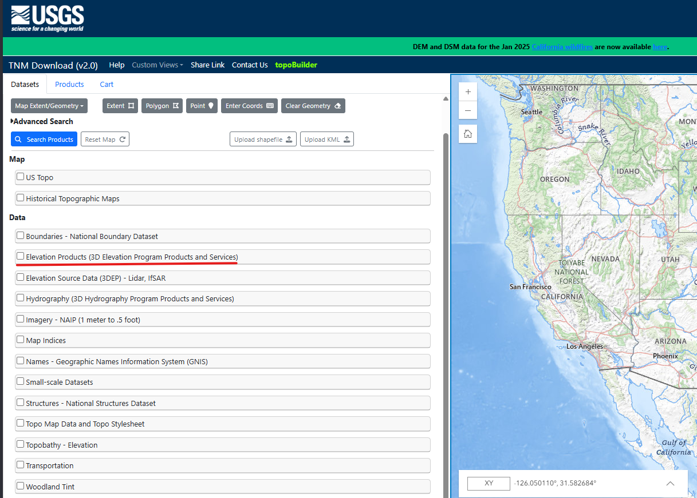
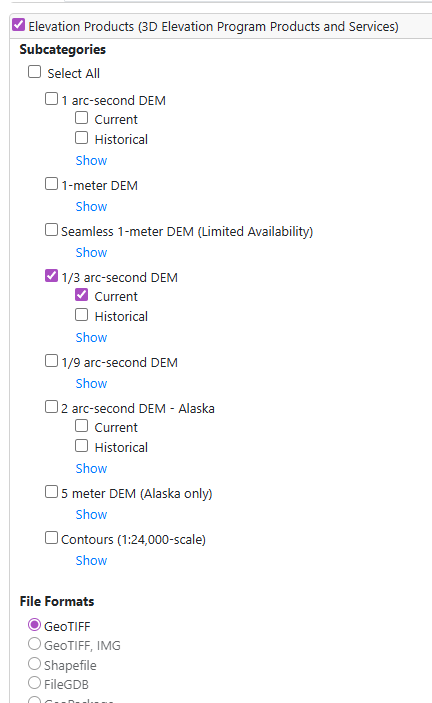
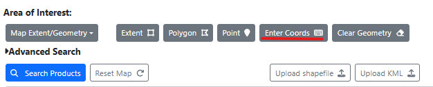
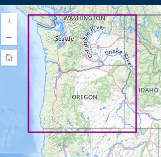
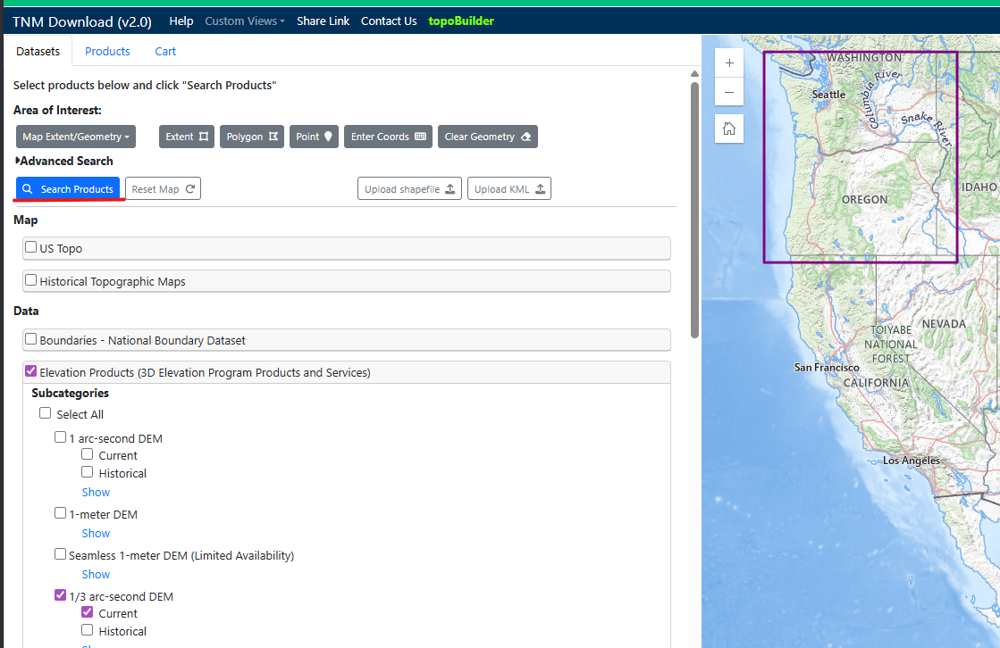
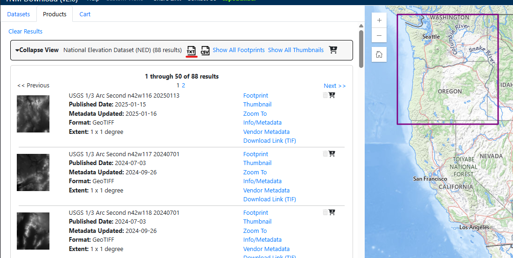
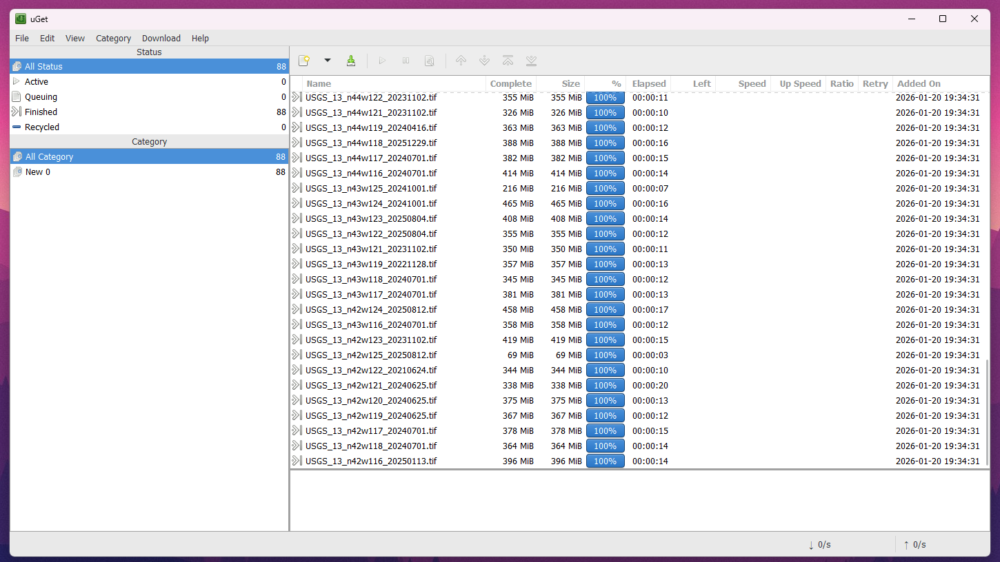

# Dataset Download Guide

This guide walks you through downloading the required elevation data using the USGS National Map Downloader.

**Resources:**

- [USGS National Map Downloader](https://apps.nationalmap.gov/downloader/)
- [uGet Download Instructions](https://apps.nationalmap.gov/uget-instructions/index.html) (Recommended for bulk downloads)

---

## Step 1: Open the Downloader

Navigate to the [USGS Downloader](https://apps.nationalmap.gov/downloader/). You should see a map interface.



## Step 2: Select Data Products

On the left sidebar, check the box for **Elevation Products (3DEP)**.



## Step 3: Choose Resolution

Select **1/3 arc-second DEM** (approx 10m resolution).

- **Format**: GeoTIFF (default)



## Step 4: Select Your Area

Use the **Box/Point** tool to define your region.



### For Pacific Northwest (PNW)

To match the tutorial preset, click **Coordinates** and enter:

- **North** (Ymax): 49.0
- **South** (Ymin): 41.75
- **East** (Xmax): -116.0
- **West** (Xmin): -125.5


### For Custom Areas

Simply draw a box around your desired region on the map.



## Step 5: Search

Click the **Search Products** button.



## Step 6: Download Files

You will see a list of results (tiles).

- **Small Area**: Click "Download" on each item.
- **Large Area**: Click "Save as Text" or "uGet" to generate a bulk download list (see [uGet Instructions](https://apps.nationalmap.gov/uget-instructions/index.html)).



## What's Next?

Once downloaded, move all ZIP files to the `data/` folder in this repository.

Then run the processing script:

```powershell
.\scripts\2_process_data.ps1
```


